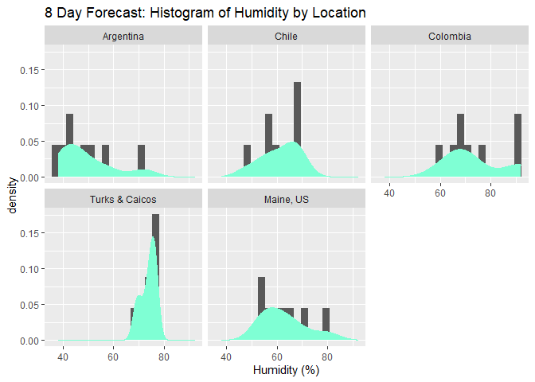

How to Access an API with an Example
================
Autumn Biggie
10/3/2021

In this document, we’ll walk through how to connect to an API, using an
example. The API we’ll be connecting to is the [OpenWeather
API](https://openweathermap.org/api). Specifically, we’ll be looking at
current and forecast weather data from the [One Call
API](https://openweathermap.org/api/one-call-api#history), one of the
many APIs that openweathermap.org offers.

## Preliminary Steps

1.  Many APIs require you to access the data using a unique API key. To
    acquire your free API key, register
    [here](https://home.openweathermap.org/users/sign_up).

2.  The following packages will be necessary in order to connect with
    the API:
    
      - `httr`  
      - `jsonlite`

3.  The following packages will be necessary in order to do some
    analyses after we load the data:
    
      - `tidyverse`  
      - `anytime`  
      - `ggplot2`

## Function to Access API

Here, I’ve written a function `weather.api` to be able to easily access
the target API. The arguments are as follows:

  - `latitude`(required): latitude of the geographic location desired  
  - `longitude`(required): longitude of the geographic location
    desired  
  - `api.id`(required): input your unique API key here  
  - `exclude`(optional): list any parts of the weather data you want to
    exclude from the results. This should be a comma-delimited list,
    with or without spaces. Case is unimportant. The options are:
      - `current`  
      - `minutely`  
      - `hourly`  
      - `daily`  
  - `units` (optional): The unit of measurement in which values are
    returned. Options are:
      - `standard`  
      - `imperial`  
      - `metric`

Note: All parameters should be in character format i.e. `latitude =
"-46.05"`.

``` r
weather.api <- function(latitude, longitude, api.id, exclude = NULL, units = "metric") {
  
  #assign the individual pieces of the required url to their respective objects  
  base <- "https://api.openweathermap.org/data/2.5/onecall"
  lat1 <- "lat="
  lat2 <- latitude
  lon1 <- "lon="
  lon2 <- longitude
  exc1 <- "exclude="
  exc2 <- tolower(sub(" ", "", exclude)) #remove spaces and convert to lowercase  
  apid1 <- "appid="
  apid2 <- api.id
  units1 <- "units="
  units2 <- units
  
  #paste pieces together  
  lat <- paste(lat1, lat2, sep = "")
  lon <- paste(lon1, lon2, sep = "")  
  ifelse(!is.null(exc2), exc <- paste(exc1, exc2, sep = ""), exc <- "nullexclude")
  apid <- paste(apid1, apid2, sep = "")
  units <- paste(units1, units2, sep = "")
  
  #paste base and latitude pieces together  
  first <- paste(base, lat, sep = "?")
  
  #create the entire url by pasting all pieces together using delimiter "&", conditioning on if any information is excluded  
  ifelse(!is.null(exc2), my.url <- paste(first, lon, exc, apid, units, sep = "&"), my.url <- paste(first, lon, apid, units, sep = "&"))
  
  #access the Weather API using the URL assembled above
  weather.info <- GET(my.url)
  
  #convert the content of the accessed data from raw to character, then present in readable data frame format
  final <- weather.info$content %>% rawToChar() %>% fromJSON()

return(final)
}
```

## Exploratory Data Analysis

Now that we can easily access the API, let’s do some exploratory data
analysis.

I want to explore the weather data of five locations that lie roughly
along the same line of longitude.

\[insert picture here\]

Locations:

  - 44.19’N, 69.47’W (Augusta, Maine, US)  
  - 21.28’N, 71.08’W (Cockburn Town, Turks & Caicos Islands, UK)  
  - 7.54’N, 72.3’W (Cucata, Colombia)  
  - 55.05’S, 67.05’W (Puerto Toro, Chile)  
  - 51.38’S, 69.13’W (Rio Gallegos, Argentina)

<!-- end list -->

``` r
Maine <- weather.api(latitude = "44.19", longitude = "-69.47", api.id = "27667529a1629f208f81fded8f7552af", exclude = "current, minutely, hourly")

Maine.day <- Maine$daily

Maine.day
```

    ##           dt    sunrise     sunset   moonrise    moonset moon_phase temp.day
    ## 1 1633363200 1633343957 1633385611 1633334820 1633384140       0.93    15.56
    ## 2 1633449600 1633430429 1633471902 1633425720 1633471920       0.97    13.26
    ## 3 1633536000 1633516901 1633558193 1633516680 1633559760       0.00    19.79
    ## 4 1633622400 1633603373 1633644485 1633607760 1633647660       0.05    19.03
    ## 5 1633708800 1633689846 1633730778 1633698900 1633735860       0.08    20.03
    ## 6 1633795200 1633776319 1633817071 1633790160 1633824300       0.12    10.38
    ## 7 1633881600 1633862792 1633903365 1633881360 1633913280       0.16    15.53
    ## 8 1633968000 1633949266 1633989660 1633972140 1634002920       0.20    17.48
    ##   temp.min temp.max temp.night temp.eve temp.morn feels_like.day
    ## 1     5.47    15.92       8.47    10.84      5.47          14.89
    ## 2     8.14    15.32       8.42    12.19      9.88          12.47
    ## 3     7.19    20.79      10.43    14.46      7.19          19.23
    ## 4     9.84    21.68      11.58    19.22      9.84          18.45
    ## 5    10.29    22.71      15.33    20.91     10.29          19.50
    ## 6     9.48    11.49      10.31    10.91     10.01           9.56
    ## 7     9.39    15.65       9.39    13.34     10.51          14.71
    ## 8     9.25    18.50      13.92    15.24      9.25          16.90
    ##   feels_like.night feels_like.eve feels_like.morn pressure humidity dew_point
    ## 1             8.47          10.07            3.69     1021       66      9.24
    ## 2             8.42          11.61            9.67     1026       70      7.58
    ## 3             9.96          14.10            6.63     1028       54      9.90
    ## 4            11.09          18.84            9.84     1024       56      9.95
    ## 5            15.11          20.83            9.75     1020       54     10.18
    ## 6             9.25           9.81            9.42     1030       80      6.78
    ## 7             8.68          12.74            9.68     1031       60      7.67
    ## 8            13.95          14.96            8.79     1021       62      9.93
    ##   wind_speed wind_deg wind_gust                           weather clouds  pop
    ## 1       2.79       42      8.33 804, Clouds, overcast clouds, 04d     95 0.29
    ## 2       1.48      264      2.11 804, Clouds, overcast clouds, 04d    100 0.12
    ## 3       1.58      179      2.04        800, Clear, clear sky, 01d      7 0.00
    ## 4       1.82      341      2.68        800, Clear, clear sky, 01d      1 0.00
    ## 5       4.37       90      8.81        800, Clear, clear sky, 01d      9 0.00
    ## 6       3.94       84      9.48        500, Rain, light rain, 10d    100 0.62
    ## 7       3.52      181      5.56 804, Clouds, overcast clouds, 04d     99 0.00
    ## 8       4.45      197      7.54     501, Rain, moderate rain, 10d     62 0.75
    ##    uvi rain
    ## 1 3.64   NA
    ## 2 3.87   NA
    ## 3 4.08   NA
    ## 4 3.93   NA
    ## 5 0.23   NA
    ## 6 1.00 0.94
    ## 7 1.00   NA
    ## 8 1.00 4.83

### Data Cleaning

Let’s convert all dates/times that are in unix form to a date/time
stamp.

``` r
Maine.day$dt <- anydate(Maine.day$dt)
Maine.day$sunrise <- anytime(Maine.day$sunrise)
Maine.day$sunset <- anytime(Maine.day$sunset)
Maine.day$moonrise <- anytime(Maine.day$moonrise)
Maine.day$moonset <- anytime(Maine.day$moonset)
```

Convert the `dt` variable into three variables, `Year`, `Month`, `Day`,
and then change `sunrise`, `sunset`, `moonrise`, and `moonset` to only
include timestamps.

``` r
Maine.day <- Maine.day %>% separate(dt, c("Year", "Month", "Day"), sep = "-", convert = TRUE, remove = TRUE)

#change sunrise, sunset, moonrise, and moonset to only include timestamps

Maine.day <- Maine.day %>% separate(sunrise, c("Date", "Sunrise"), sep = " ", remove = TRUE) %>% subset(select = -Date)

Maine.day <- Maine.day %>% separate(sunset, c("Date", "Sunset"), sep = " ", remove = TRUE) %>% subset(select = -Date)

Maine.day <- Maine.day %>% separate(moonrise, c("Date", "Moonrise"), sep = " ", remove = TRUE) %>% subset(select = -Date)

Maine.day <- Maine.day %>% separate(moonset, c("Date", "Moonset"), sep = " ", remove = TRUE) %>% subset(select = -Date)
```

Lastly, combine the nested `temp` dataframe with `Maine.day` to create a
new dataframe called `Maine.day1`, removing unwanted variables.

``` r
Maine.day1 <- data.frame(Maine.day, Maine.day$temp) %>% select(Year:moon_phase, pressure:wind_gust, clouds, pop, min, max) %>% rename(mintemp = min, maxtemp = max)

Maine.day1
```

    ##   Year Month Day  Sunrise   Sunset Moonrise  Moonset moon_phase pressure
    ## 1 2021    10   4 06:39:17 18:13:31 04:07:00 17:49:00       0.93     1021
    ## 2 2021    10   5 06:40:29 18:11:42 05:22:00 18:12:00       0.97     1026
    ## 3 2021    10   6 06:41:41 18:09:53 06:38:00 18:36:00       0.00     1028
    ## 4 2021    10   7 06:42:53 18:08:05 07:56:00 19:01:00       0.05     1024
    ## 5 2021    10   8 06:44:06 18:06:18 09:15:00 19:31:00       0.08     1020
    ## 6 2021    10   9 06:45:19 18:04:31 10:36:00 20:05:00       0.12     1030
    ## 7 2021    10  10 06:46:32 18:02:45 11:56:00 20:48:00       0.16     1031
    ## 8 2021    10  11 06:47:46 18:01:00 13:09:00 21:42:00       0.20     1021
    ##   humidity dew_point wind_speed wind_deg wind_gust clouds  pop mintemp maxtemp
    ## 1       66      9.24       2.79       42      8.33     95 0.29    5.47   15.92
    ## 2       70      7.58       1.48      264      2.11    100 0.12    8.14   15.32
    ## 3       54      9.90       1.58      179      2.04      7 0.00    7.19   20.79
    ## 4       56      9.95       1.82      341      2.68      1 0.00    9.84   21.68
    ## 5       54     10.18       4.37       90      8.81      9 0.00   10.29   22.71
    ## 6       80      6.78       3.94       84      9.48    100 0.62    9.48   11.49
    ## 7       60      7.67       3.52      181      5.56     99 0.00    9.39   15.65
    ## 8       62      9.93       4.45      197      7.54     62 0.75    9.25   18.50

Awesome\! Remember to clean the data returned from the other locations
too.

``` r
Turks.day1
```

    ##   Year Month Day  Sunrise   Sunset Moonrise  Moonset moon_phase pressure
    ## 1 2021    10   4 06:36:17 18:29:23 04:42:00 17:36:00       0.93     1013
    ## 2 2021    10   5 06:36:35 18:28:29 05:41:00 18:15:00       0.97     1015
    ## 3 2021    10   6 06:36:52 18:27:34 06:40:00 18:54:00       0.00     1016
    ## 4 2021    10   7 06:37:11 18:26:40 07:42:00 19:35:00       0.05     1016
    ## 5 2021    10   8 06:37:29 18:25:47 08:45:00 20:19:00       0.08     1015
    ## 6 2021    10   9 06:37:48 18:24:55 09:51:00 21:09:00       0.12     1014
    ## 7 2021    10  10 06:38:08 18:24:02 10:58:00 22:03:00       0.16     1014
    ## 8 2021    10  11 06:38:27 18:23:11 12:03:00 23:02:00       0.20     1014
    ##   humidity dew_point wind_speed wind_deg wind_gust clouds  pop mintemp maxtemp
    ## 1       74     23.75       9.97      132     10.86    100 1.00   26.97   28.85
    ## 2       69     22.64      11.21       99     11.87    100 0.85   27.73   28.89
    ## 3       73     23.45      11.02      100     11.83      9 0.70   28.33   28.78
    ## 4       70     22.78      10.25       97     11.02     12 0.77   28.03   28.77
    ## 5       76     23.69       8.29      101      8.80     11 0.77   28.19   28.71
    ## 6       76     24.10       9.52      115     10.09     97 0.85   28.19   28.88
    ## 7       76     24.23       9.40      123     10.04    100 0.34   28.59   28.90
    ## 8       76     24.14       8.21      102      8.81     94 0.35   28.53   28.90

``` r
Colombia.day1
```

    ##   Year Month Day  Sunrise   Sunset Moonrise  Moonset moon_phase pressure
    ## 1 2021    10   4 06:36:45 18:38:41 04:59:00 17:33:00       0.93     1011
    ## 2 2021    10   5 06:36:38 18:38:10 05:51:00 18:18:00       0.97     1014
    ## 3 2021    10   6 06:36:32 18:37:40 06:44:00 19:04:00       0.00     1016
    ## 4 2021    10   7 06:36:26 18:37:10 07:38:00 19:52:00       0.05     1016
    ## 5 2021    10   8 06:36:21 18:36:41 08:34:00 20:43:00       0.08     1015
    ## 6 2021    10   9 06:36:16 18:36:12 09:34:00 21:38:00       0.12     1015
    ## 7 2021    10  10 06:36:12 18:35:43 10:35:00 22:36:00       0.16     1015
    ## 8 2021    10  11 06:36:08 18:35:16 11:39:00 23:38:00       0.20     1016
    ##   humidity dew_point wind_speed wind_deg wind_gust clouds  pop mintemp maxtemp
    ## 1       59     14.62       3.00      109      4.24     80 0.77   12.85   23.57
    ## 2       76     15.30       2.57      108      4.02     96 1.00   12.81   19.37
    ## 3       90     15.37       2.40      119      4.46    100 0.97   12.86   18.50
    ## 4       65     13.72       2.90      117      4.93     97 0.51   12.48   20.45
    ## 5       67     14.25       2.24      110      3.28     91 0.97   12.56   20.09
    ## 6       70     15.31       1.58       64      2.16     88 1.00   12.74   19.86
    ## 7       69     14.92       1.77       87      2.34     95 1.00   13.24   20.00
    ## 8       92     16.78       1.48      202      2.13    100 0.99   13.55   16.88

``` r
Chile.day1
```

    ##   Year Month Day  Sunrise   Sunset Moonrise  Moonset moon_phase pressure
    ## 1 2021    10   4 05:45:02 18:48:25 05:49:00 16:16:00       0.93      998
    ## 2 2021    10   5 05:42:28 18:50:21 06:01:00 17:44:00       0.97     1016
    ## 3 2021    10   6 05:39:55 18:52:17 06:13:00 19:14:00       0.00     1001
    ## 4 2021    10   7 05:37:23 18:54:14 06:25:00 20:47:00       0.04     1008
    ## 5 2021    10   8 05:34:51 18:56:11 06:40:00 22:21:00       0.08      991
    ## 6 2021    10   9 05:32:20 18:58:09 06:58:00 19:00:00       0.12      996
    ## 7 2021    10  10 05:29:49 19:00:07 07:24:00 23:56:00       0.16     1001
    ## 8 2021    10  11 05:27:18 19:02:06 08:02:00 01:23:00       0.19     1001
    ##   humidity dew_point wind_speed wind_deg wind_gust clouds  pop mintemp maxtemp
    ## 1       68      2.09      12.76      258     23.26     61 0.87    1.80    8.11
    ## 2       67     -1.09      10.73      239     17.84     60 0.88    1.78    6.54
    ## 3       65      2.86       8.38      247     16.03     27 1.00    1.82    9.56
    ## 4       56     -1.71       7.69      250     15.14     99 0.01    1.20    8.52
    ## 5       56      2.06      11.36      255     19.84    100 0.39    4.52   10.90
    ## 6       69     -0.16      12.10      345     25.54    100 0.94    1.78   10.20
    ## 7       61     -0.62       6.06      325     11.53     65 0.79    2.83    9.71
    ## 8       48     -3.74       7.94      256     15.55      6 0.01    3.70    7.90

``` r
Argentina.day1
```

    ##   Year Month Day  Sunrise   Sunset Moonrise  Moonset moon_phase pressure
    ## 1 2021    10   4 05:57:04 18:53:01 05:49:00 16:32:00       0.93     1007
    ## 2 2021    10   5 05:54:48 18:54:39 06:06:00 17:54:00       0.97     1021
    ## 3 2021    10   6 05:52:32 18:56:19 06:23:00 19:19:00       0.00     1011
    ## 4 2021    10   7 05:50:17 18:57:58 06:40:00 20:46:00       0.04     1015
    ## 5 2021    10   8 05:48:02 18:59:38 06:59:00 22:15:00       0.08     1002
    ## 6 2021    10   9 05:45:48 19:01:19 07:22:00 19:00:00       0.12     1004
    ## 7 2021    10  10 05:43:34 19:03:00 07:54:00 23:43:00       0.16     1005
    ## 8 2021    10  11 05:41:21 19:04:41 08:37:00 01:07:00       0.19     1009
    ##   humidity dew_point wind_speed wind_deg wind_gust clouds  pop mintemp maxtemp
    ## 1       41     -2.40      15.54      246     23.00     72 0.32    3.24   10.34
    ## 2       42     -4.55      14.71      232     21.43      6 0.00    1.72    9.71
    ## 3       47     -1.30      12.12      237     18.91    100 0.27    4.50   11.81
    ## 4       58      2.10       9.15      240     15.06     25 0.00    3.46   10.35
    ## 5       44      1.23      14.32      225     18.93    100 0.00    6.28   14.02
    ## 6       51      3.64      14.20        9     19.96    100 0.00    3.87   17.04
    ## 7       72      4.72       6.73       35      8.95     90 0.28    7.05   15.10
    ## 8       38     -5.69      14.30      244     17.62     35 0.40    4.59    9.27

Now, let’s combine all datasets into one called `weather`, creating a
new variable called `location`.

``` r
Maine.day1 <- Maine.day1 %>% mutate(location = "Maine, US")
Turks.day1 <- Turks.day1 %>% mutate(location = "Turks & Caicos")
Colombia.day1 <- Colombia.day1 %>% mutate(location = "Colombia")
Chile.day1 <- Chile.day1 %>% mutate(location = "Chile")
Argentina.day1 <- Argentina.day1 %>% mutate(location = "Argentina")

weather <- rbind(Maine.day1, Turks.day1, Colombia.day1, Chile.day1, Argentina.day1) %>% relocate(location, .before = Year)

weather
```

    ##          location Year Month Day  Sunrise   Sunset Moonrise  Moonset moon_phase
    ## 1       Maine, US 2021    10   4 06:39:17 18:13:31 04:07:00 17:49:00       0.93
    ## 2       Maine, US 2021    10   5 06:40:29 18:11:42 05:22:00 18:12:00       0.97
    ## 3       Maine, US 2021    10   6 06:41:41 18:09:53 06:38:00 18:36:00       0.00
    ## 4       Maine, US 2021    10   7 06:42:53 18:08:05 07:56:00 19:01:00       0.05
    ## 5       Maine, US 2021    10   8 06:44:06 18:06:18 09:15:00 19:31:00       0.08
    ## 6       Maine, US 2021    10   9 06:45:19 18:04:31 10:36:00 20:05:00       0.12
    ## 7       Maine, US 2021    10  10 06:46:32 18:02:45 11:56:00 20:48:00       0.16
    ## 8       Maine, US 2021    10  11 06:47:46 18:01:00 13:09:00 21:42:00       0.20
    ## 9  Turks & Caicos 2021    10   4 06:36:17 18:29:23 04:42:00 17:36:00       0.93
    ## 10 Turks & Caicos 2021    10   5 06:36:35 18:28:29 05:41:00 18:15:00       0.97
    ## 11 Turks & Caicos 2021    10   6 06:36:52 18:27:34 06:40:00 18:54:00       0.00
    ## 12 Turks & Caicos 2021    10   7 06:37:11 18:26:40 07:42:00 19:35:00       0.05
    ## 13 Turks & Caicos 2021    10   8 06:37:29 18:25:47 08:45:00 20:19:00       0.08
    ## 14 Turks & Caicos 2021    10   9 06:37:48 18:24:55 09:51:00 21:09:00       0.12
    ## 15 Turks & Caicos 2021    10  10 06:38:08 18:24:02 10:58:00 22:03:00       0.16
    ## 16 Turks & Caicos 2021    10  11 06:38:27 18:23:11 12:03:00 23:02:00       0.20
    ## 17       Colombia 2021    10   4 06:36:45 18:38:41 04:59:00 17:33:00       0.93
    ## 18       Colombia 2021    10   5 06:36:38 18:38:10 05:51:00 18:18:00       0.97
    ## 19       Colombia 2021    10   6 06:36:32 18:37:40 06:44:00 19:04:00       0.00
    ## 20       Colombia 2021    10   7 06:36:26 18:37:10 07:38:00 19:52:00       0.05
    ## 21       Colombia 2021    10   8 06:36:21 18:36:41 08:34:00 20:43:00       0.08
    ## 22       Colombia 2021    10   9 06:36:16 18:36:12 09:34:00 21:38:00       0.12
    ## 23       Colombia 2021    10  10 06:36:12 18:35:43 10:35:00 22:36:00       0.16
    ## 24       Colombia 2021    10  11 06:36:08 18:35:16 11:39:00 23:38:00       0.20
    ## 25          Chile 2021    10   4 05:45:02 18:48:25 05:49:00 16:16:00       0.93
    ## 26          Chile 2021    10   5 05:42:28 18:50:21 06:01:00 17:44:00       0.97
    ## 27          Chile 2021    10   6 05:39:55 18:52:17 06:13:00 19:14:00       0.00
    ## 28          Chile 2021    10   7 05:37:23 18:54:14 06:25:00 20:47:00       0.04
    ## 29          Chile 2021    10   8 05:34:51 18:56:11 06:40:00 22:21:00       0.08
    ## 30          Chile 2021    10   9 05:32:20 18:58:09 06:58:00 19:00:00       0.12
    ## 31          Chile 2021    10  10 05:29:49 19:00:07 07:24:00 23:56:00       0.16
    ## 32          Chile 2021    10  11 05:27:18 19:02:06 08:02:00 01:23:00       0.19
    ## 33      Argentina 2021    10   4 05:57:04 18:53:01 05:49:00 16:32:00       0.93
    ## 34      Argentina 2021    10   5 05:54:48 18:54:39 06:06:00 17:54:00       0.97
    ## 35      Argentina 2021    10   6 05:52:32 18:56:19 06:23:00 19:19:00       0.00
    ## 36      Argentina 2021    10   7 05:50:17 18:57:58 06:40:00 20:46:00       0.04
    ## 37      Argentina 2021    10   8 05:48:02 18:59:38 06:59:00 22:15:00       0.08
    ## 38      Argentina 2021    10   9 05:45:48 19:01:19 07:22:00 19:00:00       0.12
    ## 39      Argentina 2021    10  10 05:43:34 19:03:00 07:54:00 23:43:00       0.16
    ## 40      Argentina 2021    10  11 05:41:21 19:04:41 08:37:00 01:07:00       0.19
    ##    pressure humidity dew_point wind_speed wind_deg wind_gust clouds  pop
    ## 1      1021       66      9.24       2.79       42      8.33     95 0.29
    ## 2      1026       70      7.58       1.48      264      2.11    100 0.12
    ## 3      1028       54      9.90       1.58      179      2.04      7 0.00
    ## 4      1024       56      9.95       1.82      341      2.68      1 0.00
    ## 5      1020       54     10.18       4.37       90      8.81      9 0.00
    ## 6      1030       80      6.78       3.94       84      9.48    100 0.62
    ## 7      1031       60      7.67       3.52      181      5.56     99 0.00
    ## 8      1021       62      9.93       4.45      197      7.54     62 0.75
    ## 9      1013       74     23.75       9.97      132     10.86    100 1.00
    ## 10     1015       69     22.64      11.21       99     11.87    100 0.85
    ## 11     1016       73     23.45      11.02      100     11.83      9 0.70
    ## 12     1016       70     22.78      10.25       97     11.02     12 0.77
    ## 13     1015       76     23.69       8.29      101      8.80     11 0.77
    ## 14     1014       76     24.10       9.52      115     10.09     97 0.85
    ## 15     1014       76     24.23       9.40      123     10.04    100 0.34
    ## 16     1014       76     24.14       8.21      102      8.81     94 0.35
    ## 17     1011       59     14.62       3.00      109      4.24     80 0.77
    ## 18     1014       76     15.30       2.57      108      4.02     96 1.00
    ## 19     1016       90     15.37       2.40      119      4.46    100 0.97
    ## 20     1016       65     13.72       2.90      117      4.93     97 0.51
    ## 21     1015       67     14.25       2.24      110      3.28     91 0.97
    ## 22     1015       70     15.31       1.58       64      2.16     88 1.00
    ## 23     1015       69     14.92       1.77       87      2.34     95 1.00
    ## 24     1016       92     16.78       1.48      202      2.13    100 0.99
    ## 25      998       68      2.09      12.76      258     23.26     61 0.87
    ## 26     1016       67     -1.09      10.73      239     17.84     60 0.88
    ## 27     1001       65      2.86       8.38      247     16.03     27 1.00
    ## 28     1008       56     -1.71       7.69      250     15.14     99 0.01
    ## 29      991       56      2.06      11.36      255     19.84    100 0.39
    ## 30      996       69     -0.16      12.10      345     25.54    100 0.94
    ## 31     1001       61     -0.62       6.06      325     11.53     65 0.79
    ## 32     1001       48     -3.74       7.94      256     15.55      6 0.01
    ## 33     1007       41     -2.40      15.54      246     23.00     72 0.32
    ## 34     1021       42     -4.55      14.71      232     21.43      6 0.00
    ## 35     1011       47     -1.30      12.12      237     18.91    100 0.27
    ## 36     1015       58      2.10       9.15      240     15.06     25 0.00
    ## 37     1002       44      1.23      14.32      225     18.93    100 0.00
    ## 38     1004       51      3.64      14.20        9     19.96    100 0.00
    ## 39     1005       72      4.72       6.73       35      8.95     90 0.28
    ## 40     1009       38     -5.69      14.30      244     17.62     35 0.40
    ##    mintemp maxtemp
    ## 1     5.47   15.92
    ## 2     8.14   15.32
    ## 3     7.19   20.79
    ## 4     9.84   21.68
    ## 5    10.29   22.71
    ## 6     9.48   11.49
    ## 7     9.39   15.65
    ## 8     9.25   18.50
    ## 9    26.97   28.85
    ## 10   27.73   28.89
    ## 11   28.33   28.78
    ## 12   28.03   28.77
    ## 13   28.19   28.71
    ## 14   28.19   28.88
    ## 15   28.59   28.90
    ## 16   28.53   28.90
    ## 17   12.85   23.57
    ## 18   12.81   19.37
    ## 19   12.86   18.50
    ## 20   12.48   20.45
    ## 21   12.56   20.09
    ## 22   12.74   19.86
    ## 23   13.24   20.00
    ## 24   13.55   16.88
    ## 25    1.80    8.11
    ## 26    1.78    6.54
    ## 27    1.82    9.56
    ## 28    1.20    8.52
    ## 29    4.52   10.90
    ## 30    1.78   10.20
    ## 31    2.83    9.71
    ## 32    3.70    7.90
    ## 33    3.24   10.34
    ## 34    1.72    9.71
    ## 35    4.50   11.81
    ## 36    3.46   10.35
    ## 37    6.28   14.02
    ## 38    3.87   17.04
    ## 39    7.05   15.10
    ## 40    4.59    9.27

### Create New Variables

I’m interested in converting `humidity` and `clouds` into categorical
variables with different levels.

I’ll begin with humidity. Lets say that if `humidity` \(\le\) 60, there
is low humidity, if 60 \< `humidity` \(\le\) 80, there is medium
humidity, and if `humidity` \> 80, there is high humidity.

``` r
weather <- weather %>% mutate(humidity.status = as.factor(ifelse(humidity > 80, "High", ifelse(humidity >60, "Medium", "Low"))))

weather$humidity.status <- ordered(weather$humidity.status, levels = c("Low", "Medium", "High"))

weather
```

    ##          location Year Month Day  Sunrise   Sunset Moonrise  Moonset moon_phase
    ## 1       Maine, US 2021    10   4 06:39:17 18:13:31 04:07:00 17:49:00       0.93
    ## 2       Maine, US 2021    10   5 06:40:29 18:11:42 05:22:00 18:12:00       0.97
    ## 3       Maine, US 2021    10   6 06:41:41 18:09:53 06:38:00 18:36:00       0.00
    ## 4       Maine, US 2021    10   7 06:42:53 18:08:05 07:56:00 19:01:00       0.05
    ## 5       Maine, US 2021    10   8 06:44:06 18:06:18 09:15:00 19:31:00       0.08
    ## 6       Maine, US 2021    10   9 06:45:19 18:04:31 10:36:00 20:05:00       0.12
    ## 7       Maine, US 2021    10  10 06:46:32 18:02:45 11:56:00 20:48:00       0.16
    ## 8       Maine, US 2021    10  11 06:47:46 18:01:00 13:09:00 21:42:00       0.20
    ## 9  Turks & Caicos 2021    10   4 06:36:17 18:29:23 04:42:00 17:36:00       0.93
    ## 10 Turks & Caicos 2021    10   5 06:36:35 18:28:29 05:41:00 18:15:00       0.97
    ## 11 Turks & Caicos 2021    10   6 06:36:52 18:27:34 06:40:00 18:54:00       0.00
    ## 12 Turks & Caicos 2021    10   7 06:37:11 18:26:40 07:42:00 19:35:00       0.05
    ## 13 Turks & Caicos 2021    10   8 06:37:29 18:25:47 08:45:00 20:19:00       0.08
    ## 14 Turks & Caicos 2021    10   9 06:37:48 18:24:55 09:51:00 21:09:00       0.12
    ## 15 Turks & Caicos 2021    10  10 06:38:08 18:24:02 10:58:00 22:03:00       0.16
    ## 16 Turks & Caicos 2021    10  11 06:38:27 18:23:11 12:03:00 23:02:00       0.20
    ## 17       Colombia 2021    10   4 06:36:45 18:38:41 04:59:00 17:33:00       0.93
    ## 18       Colombia 2021    10   5 06:36:38 18:38:10 05:51:00 18:18:00       0.97
    ## 19       Colombia 2021    10   6 06:36:32 18:37:40 06:44:00 19:04:00       0.00
    ## 20       Colombia 2021    10   7 06:36:26 18:37:10 07:38:00 19:52:00       0.05
    ## 21       Colombia 2021    10   8 06:36:21 18:36:41 08:34:00 20:43:00       0.08
    ## 22       Colombia 2021    10   9 06:36:16 18:36:12 09:34:00 21:38:00       0.12
    ## 23       Colombia 2021    10  10 06:36:12 18:35:43 10:35:00 22:36:00       0.16
    ## 24       Colombia 2021    10  11 06:36:08 18:35:16 11:39:00 23:38:00       0.20
    ## 25          Chile 2021    10   4 05:45:02 18:48:25 05:49:00 16:16:00       0.93
    ## 26          Chile 2021    10   5 05:42:28 18:50:21 06:01:00 17:44:00       0.97
    ## 27          Chile 2021    10   6 05:39:55 18:52:17 06:13:00 19:14:00       0.00
    ## 28          Chile 2021    10   7 05:37:23 18:54:14 06:25:00 20:47:00       0.04
    ## 29          Chile 2021    10   8 05:34:51 18:56:11 06:40:00 22:21:00       0.08
    ## 30          Chile 2021    10   9 05:32:20 18:58:09 06:58:00 19:00:00       0.12
    ## 31          Chile 2021    10  10 05:29:49 19:00:07 07:24:00 23:56:00       0.16
    ## 32          Chile 2021    10  11 05:27:18 19:02:06 08:02:00 01:23:00       0.19
    ## 33      Argentina 2021    10   4 05:57:04 18:53:01 05:49:00 16:32:00       0.93
    ## 34      Argentina 2021    10   5 05:54:48 18:54:39 06:06:00 17:54:00       0.97
    ## 35      Argentina 2021    10   6 05:52:32 18:56:19 06:23:00 19:19:00       0.00
    ## 36      Argentina 2021    10   7 05:50:17 18:57:58 06:40:00 20:46:00       0.04
    ## 37      Argentina 2021    10   8 05:48:02 18:59:38 06:59:00 22:15:00       0.08
    ## 38      Argentina 2021    10   9 05:45:48 19:01:19 07:22:00 19:00:00       0.12
    ## 39      Argentina 2021    10  10 05:43:34 19:03:00 07:54:00 23:43:00       0.16
    ## 40      Argentina 2021    10  11 05:41:21 19:04:41 08:37:00 01:07:00       0.19
    ##    pressure humidity dew_point wind_speed wind_deg wind_gust clouds  pop
    ## 1      1021       66      9.24       2.79       42      8.33     95 0.29
    ## 2      1026       70      7.58       1.48      264      2.11    100 0.12
    ## 3      1028       54      9.90       1.58      179      2.04      7 0.00
    ## 4      1024       56      9.95       1.82      341      2.68      1 0.00
    ## 5      1020       54     10.18       4.37       90      8.81      9 0.00
    ## 6      1030       80      6.78       3.94       84      9.48    100 0.62
    ## 7      1031       60      7.67       3.52      181      5.56     99 0.00
    ## 8      1021       62      9.93       4.45      197      7.54     62 0.75
    ## 9      1013       74     23.75       9.97      132     10.86    100 1.00
    ## 10     1015       69     22.64      11.21       99     11.87    100 0.85
    ## 11     1016       73     23.45      11.02      100     11.83      9 0.70
    ## 12     1016       70     22.78      10.25       97     11.02     12 0.77
    ## 13     1015       76     23.69       8.29      101      8.80     11 0.77
    ## 14     1014       76     24.10       9.52      115     10.09     97 0.85
    ## 15     1014       76     24.23       9.40      123     10.04    100 0.34
    ## 16     1014       76     24.14       8.21      102      8.81     94 0.35
    ## 17     1011       59     14.62       3.00      109      4.24     80 0.77
    ## 18     1014       76     15.30       2.57      108      4.02     96 1.00
    ## 19     1016       90     15.37       2.40      119      4.46    100 0.97
    ## 20     1016       65     13.72       2.90      117      4.93     97 0.51
    ## 21     1015       67     14.25       2.24      110      3.28     91 0.97
    ## 22     1015       70     15.31       1.58       64      2.16     88 1.00
    ## 23     1015       69     14.92       1.77       87      2.34     95 1.00
    ## 24     1016       92     16.78       1.48      202      2.13    100 0.99
    ## 25      998       68      2.09      12.76      258     23.26     61 0.87
    ## 26     1016       67     -1.09      10.73      239     17.84     60 0.88
    ## 27     1001       65      2.86       8.38      247     16.03     27 1.00
    ## 28     1008       56     -1.71       7.69      250     15.14     99 0.01
    ## 29      991       56      2.06      11.36      255     19.84    100 0.39
    ## 30      996       69     -0.16      12.10      345     25.54    100 0.94
    ## 31     1001       61     -0.62       6.06      325     11.53     65 0.79
    ## 32     1001       48     -3.74       7.94      256     15.55      6 0.01
    ## 33     1007       41     -2.40      15.54      246     23.00     72 0.32
    ## 34     1021       42     -4.55      14.71      232     21.43      6 0.00
    ## 35     1011       47     -1.30      12.12      237     18.91    100 0.27
    ## 36     1015       58      2.10       9.15      240     15.06     25 0.00
    ## 37     1002       44      1.23      14.32      225     18.93    100 0.00
    ## 38     1004       51      3.64      14.20        9     19.96    100 0.00
    ## 39     1005       72      4.72       6.73       35      8.95     90 0.28
    ## 40     1009       38     -5.69      14.30      244     17.62     35 0.40
    ##    mintemp maxtemp humidity.status
    ## 1     5.47   15.92          Medium
    ## 2     8.14   15.32          Medium
    ## 3     7.19   20.79             Low
    ## 4     9.84   21.68             Low
    ## 5    10.29   22.71             Low
    ## 6     9.48   11.49          Medium
    ## 7     9.39   15.65             Low
    ## 8     9.25   18.50          Medium
    ## 9    26.97   28.85          Medium
    ## 10   27.73   28.89          Medium
    ## 11   28.33   28.78          Medium
    ## 12   28.03   28.77          Medium
    ## 13   28.19   28.71          Medium
    ## 14   28.19   28.88          Medium
    ## 15   28.59   28.90          Medium
    ## 16   28.53   28.90          Medium
    ## 17   12.85   23.57             Low
    ## 18   12.81   19.37          Medium
    ## 19   12.86   18.50            High
    ## 20   12.48   20.45          Medium
    ## 21   12.56   20.09          Medium
    ## 22   12.74   19.86          Medium
    ## 23   13.24   20.00          Medium
    ## 24   13.55   16.88            High
    ## 25    1.80    8.11          Medium
    ## 26    1.78    6.54          Medium
    ## 27    1.82    9.56          Medium
    ## 28    1.20    8.52             Low
    ## 29    4.52   10.90             Low
    ## 30    1.78   10.20          Medium
    ## 31    2.83    9.71          Medium
    ## 32    3.70    7.90             Low
    ## 33    3.24   10.34             Low
    ## 34    1.72    9.71             Low
    ## 35    4.50   11.81             Low
    ## 36    3.46   10.35             Low
    ## 37    6.28   14.02             Low
    ## 38    3.87   17.04             Low
    ## 39    7.05   15.10          Medium
    ## 40    4.59    9.27             Low

Great\! Now let’s look at `clouds`. If `clouds` \(\le\) 25, then cloud
coverage is low. If `clouds` \> 75 then cloud coverage is high, and
anything in between is medium.

``` r
weather <- weather %>% mutate(cloud.coverage = as.factor(ifelse(clouds > 75, "High", ifelse(clouds > 25, "Medium", "Low"))))

weather$cloud.coverage <- ordered(weather$cloud.coverage, levels = c("Low", "Medium", "High"))

weather
```

    ##          location Year Month Day  Sunrise   Sunset Moonrise  Moonset moon_phase
    ## 1       Maine, US 2021    10   4 06:39:17 18:13:31 04:07:00 17:49:00       0.93
    ## 2       Maine, US 2021    10   5 06:40:29 18:11:42 05:22:00 18:12:00       0.97
    ## 3       Maine, US 2021    10   6 06:41:41 18:09:53 06:38:00 18:36:00       0.00
    ## 4       Maine, US 2021    10   7 06:42:53 18:08:05 07:56:00 19:01:00       0.05
    ## 5       Maine, US 2021    10   8 06:44:06 18:06:18 09:15:00 19:31:00       0.08
    ## 6       Maine, US 2021    10   9 06:45:19 18:04:31 10:36:00 20:05:00       0.12
    ## 7       Maine, US 2021    10  10 06:46:32 18:02:45 11:56:00 20:48:00       0.16
    ## 8       Maine, US 2021    10  11 06:47:46 18:01:00 13:09:00 21:42:00       0.20
    ## 9  Turks & Caicos 2021    10   4 06:36:17 18:29:23 04:42:00 17:36:00       0.93
    ## 10 Turks & Caicos 2021    10   5 06:36:35 18:28:29 05:41:00 18:15:00       0.97
    ## 11 Turks & Caicos 2021    10   6 06:36:52 18:27:34 06:40:00 18:54:00       0.00
    ## 12 Turks & Caicos 2021    10   7 06:37:11 18:26:40 07:42:00 19:35:00       0.05
    ## 13 Turks & Caicos 2021    10   8 06:37:29 18:25:47 08:45:00 20:19:00       0.08
    ## 14 Turks & Caicos 2021    10   9 06:37:48 18:24:55 09:51:00 21:09:00       0.12
    ## 15 Turks & Caicos 2021    10  10 06:38:08 18:24:02 10:58:00 22:03:00       0.16
    ## 16 Turks & Caicos 2021    10  11 06:38:27 18:23:11 12:03:00 23:02:00       0.20
    ## 17       Colombia 2021    10   4 06:36:45 18:38:41 04:59:00 17:33:00       0.93
    ## 18       Colombia 2021    10   5 06:36:38 18:38:10 05:51:00 18:18:00       0.97
    ## 19       Colombia 2021    10   6 06:36:32 18:37:40 06:44:00 19:04:00       0.00
    ## 20       Colombia 2021    10   7 06:36:26 18:37:10 07:38:00 19:52:00       0.05
    ## 21       Colombia 2021    10   8 06:36:21 18:36:41 08:34:00 20:43:00       0.08
    ## 22       Colombia 2021    10   9 06:36:16 18:36:12 09:34:00 21:38:00       0.12
    ## 23       Colombia 2021    10  10 06:36:12 18:35:43 10:35:00 22:36:00       0.16
    ## 24       Colombia 2021    10  11 06:36:08 18:35:16 11:39:00 23:38:00       0.20
    ## 25          Chile 2021    10   4 05:45:02 18:48:25 05:49:00 16:16:00       0.93
    ## 26          Chile 2021    10   5 05:42:28 18:50:21 06:01:00 17:44:00       0.97
    ## 27          Chile 2021    10   6 05:39:55 18:52:17 06:13:00 19:14:00       0.00
    ## 28          Chile 2021    10   7 05:37:23 18:54:14 06:25:00 20:47:00       0.04
    ## 29          Chile 2021    10   8 05:34:51 18:56:11 06:40:00 22:21:00       0.08
    ## 30          Chile 2021    10   9 05:32:20 18:58:09 06:58:00 19:00:00       0.12
    ## 31          Chile 2021    10  10 05:29:49 19:00:07 07:24:00 23:56:00       0.16
    ## 32          Chile 2021    10  11 05:27:18 19:02:06 08:02:00 01:23:00       0.19
    ## 33      Argentina 2021    10   4 05:57:04 18:53:01 05:49:00 16:32:00       0.93
    ## 34      Argentina 2021    10   5 05:54:48 18:54:39 06:06:00 17:54:00       0.97
    ## 35      Argentina 2021    10   6 05:52:32 18:56:19 06:23:00 19:19:00       0.00
    ## 36      Argentina 2021    10   7 05:50:17 18:57:58 06:40:00 20:46:00       0.04
    ## 37      Argentina 2021    10   8 05:48:02 18:59:38 06:59:00 22:15:00       0.08
    ## 38      Argentina 2021    10   9 05:45:48 19:01:19 07:22:00 19:00:00       0.12
    ## 39      Argentina 2021    10  10 05:43:34 19:03:00 07:54:00 23:43:00       0.16
    ## 40      Argentina 2021    10  11 05:41:21 19:04:41 08:37:00 01:07:00       0.19
    ##    pressure humidity dew_point wind_speed wind_deg wind_gust clouds  pop
    ## 1      1021       66      9.24       2.79       42      8.33     95 0.29
    ## 2      1026       70      7.58       1.48      264      2.11    100 0.12
    ## 3      1028       54      9.90       1.58      179      2.04      7 0.00
    ## 4      1024       56      9.95       1.82      341      2.68      1 0.00
    ## 5      1020       54     10.18       4.37       90      8.81      9 0.00
    ## 6      1030       80      6.78       3.94       84      9.48    100 0.62
    ## 7      1031       60      7.67       3.52      181      5.56     99 0.00
    ## 8      1021       62      9.93       4.45      197      7.54     62 0.75
    ## 9      1013       74     23.75       9.97      132     10.86    100 1.00
    ## 10     1015       69     22.64      11.21       99     11.87    100 0.85
    ## 11     1016       73     23.45      11.02      100     11.83      9 0.70
    ## 12     1016       70     22.78      10.25       97     11.02     12 0.77
    ## 13     1015       76     23.69       8.29      101      8.80     11 0.77
    ## 14     1014       76     24.10       9.52      115     10.09     97 0.85
    ## 15     1014       76     24.23       9.40      123     10.04    100 0.34
    ## 16     1014       76     24.14       8.21      102      8.81     94 0.35
    ## 17     1011       59     14.62       3.00      109      4.24     80 0.77
    ## 18     1014       76     15.30       2.57      108      4.02     96 1.00
    ## 19     1016       90     15.37       2.40      119      4.46    100 0.97
    ## 20     1016       65     13.72       2.90      117      4.93     97 0.51
    ## 21     1015       67     14.25       2.24      110      3.28     91 0.97
    ## 22     1015       70     15.31       1.58       64      2.16     88 1.00
    ## 23     1015       69     14.92       1.77       87      2.34     95 1.00
    ## 24     1016       92     16.78       1.48      202      2.13    100 0.99
    ## 25      998       68      2.09      12.76      258     23.26     61 0.87
    ## 26     1016       67     -1.09      10.73      239     17.84     60 0.88
    ## 27     1001       65      2.86       8.38      247     16.03     27 1.00
    ## 28     1008       56     -1.71       7.69      250     15.14     99 0.01
    ## 29      991       56      2.06      11.36      255     19.84    100 0.39
    ## 30      996       69     -0.16      12.10      345     25.54    100 0.94
    ## 31     1001       61     -0.62       6.06      325     11.53     65 0.79
    ## 32     1001       48     -3.74       7.94      256     15.55      6 0.01
    ## 33     1007       41     -2.40      15.54      246     23.00     72 0.32
    ## 34     1021       42     -4.55      14.71      232     21.43      6 0.00
    ## 35     1011       47     -1.30      12.12      237     18.91    100 0.27
    ## 36     1015       58      2.10       9.15      240     15.06     25 0.00
    ## 37     1002       44      1.23      14.32      225     18.93    100 0.00
    ## 38     1004       51      3.64      14.20        9     19.96    100 0.00
    ## 39     1005       72      4.72       6.73       35      8.95     90 0.28
    ## 40     1009       38     -5.69      14.30      244     17.62     35 0.40
    ##    mintemp maxtemp humidity.status cloud.coverage
    ## 1     5.47   15.92          Medium           High
    ## 2     8.14   15.32          Medium           High
    ## 3     7.19   20.79             Low            Low
    ## 4     9.84   21.68             Low            Low
    ## 5    10.29   22.71             Low            Low
    ## 6     9.48   11.49          Medium           High
    ## 7     9.39   15.65             Low           High
    ## 8     9.25   18.50          Medium         Medium
    ## 9    26.97   28.85          Medium           High
    ## 10   27.73   28.89          Medium           High
    ## 11   28.33   28.78          Medium            Low
    ## 12   28.03   28.77          Medium            Low
    ## 13   28.19   28.71          Medium            Low
    ## 14   28.19   28.88          Medium           High
    ## 15   28.59   28.90          Medium           High
    ## 16   28.53   28.90          Medium           High
    ## 17   12.85   23.57             Low           High
    ## 18   12.81   19.37          Medium           High
    ## 19   12.86   18.50            High           High
    ## 20   12.48   20.45          Medium           High
    ## 21   12.56   20.09          Medium           High
    ## 22   12.74   19.86          Medium           High
    ## 23   13.24   20.00          Medium           High
    ## 24   13.55   16.88            High           High
    ## 25    1.80    8.11          Medium         Medium
    ## 26    1.78    6.54          Medium         Medium
    ## 27    1.82    9.56          Medium         Medium
    ## 28    1.20    8.52             Low           High
    ## 29    4.52   10.90             Low           High
    ## 30    1.78   10.20          Medium           High
    ## 31    2.83    9.71          Medium         Medium
    ## 32    3.70    7.90             Low            Low
    ## 33    3.24   10.34             Low         Medium
    ## 34    1.72    9.71             Low            Low
    ## 35    4.50   11.81             Low           High
    ## 36    3.46   10.35             Low            Low
    ## 37    6.28   14.02             Low           High
    ## 38    3.87   17.04             Low           High
    ## 39    7.05   15.10          Medium           High
    ## 40    4.59    9.27             Low         Medium

### Contingency Tables

``` r
tabz1 <- table(weather$humidity.status, weather$cloud.coverage, deparse.level = 2)

tabz1
```

    ##                        weather$cloud.coverage
    ## weather$humidity.status Low Medium High
    ##                  Low      6      2    7
    ##                  Medium   3      5   15
    ##                  High     0      0    2

``` r
tabz2 <- table(weather$humidity.status, weather$cloud.coverage, weather$location, deparse.level = 2)

tabz2
```

    ## , , weather$location = Argentina
    ## 
    ##                        weather$cloud.coverage
    ## weather$humidity.status Low Medium High
    ##                  Low      2      2    3
    ##                  Medium   0      0    1
    ##                  High     0      0    0
    ## 
    ## , , weather$location = Chile
    ## 
    ##                        weather$cloud.coverage
    ## weather$humidity.status Low Medium High
    ##                  Low      1      0    2
    ##                  Medium   0      4    1
    ##                  High     0      0    0
    ## 
    ## , , weather$location = Colombia
    ## 
    ##                        weather$cloud.coverage
    ## weather$humidity.status Low Medium High
    ##                  Low      0      0    1
    ##                  Medium   0      0    5
    ##                  High     0      0    2
    ## 
    ## , , weather$location = Maine, US
    ## 
    ##                        weather$cloud.coverage
    ## weather$humidity.status Low Medium High
    ##                  Low      3      0    1
    ##                  Medium   0      1    3
    ##                  High     0      0    0
    ## 
    ## , , weather$location = Turks & Caicos
    ## 
    ##                        weather$cloud.coverage
    ## weather$humidity.status Low Medium High
    ##                  Low      0      0    0
    ##                  Medium   3      0    5
    ##                  High     0      0    0

### Numerical Summaries

``` r
weather$location <- ordered(weather$location, levels = c("Argentina", "Chile", "Colombia", "Turks & Caicos", "Maine, US"))

weather %>% group_by(location) %>% summarise(avghigh = mean(maxtemp), avglow = mean(mintemp), sdhigh = sd(maxtemp), sdlow = sd(mintemp), IQR = IQR(maxtemp))
```

    ## # A tibble: 5 x 6
    ##   location       avghigh avglow sdhigh sdlow   IQR
    ##   <ord>            <dbl>  <dbl>  <dbl> <dbl> <dbl>
    ## 1 Argentina        12.2    4.34 2.85   1.70  4.11 
    ## 2 Chile             8.93   2.43 1.42   1.15  1.78 
    ## 3 Colombia         19.8   12.9  1.90   0.352 1.03 
    ## 4 Turks & Caicos   28.8   28.1  0.0723 0.522 0.115
    ## 5 Maine, US        17.8    8.63 3.83   1.61  5.44

``` r
weather %>% group_by(location) %>% summarise(avg_humidity = mean(humidity), sd.humidity = sd(humidity))
```

    ## # A tibble: 5 x 3
    ##   location       avg_humidity sd.humidity
    ##   <ord>                 <dbl>       <dbl>
    ## 1 Argentina              49.1       11.2 
    ## 2 Chile                  61.2        7.40
    ## 3 Colombia               73.5       11.8 
    ## 4 Turks & Caicos         73.8        2.87
    ## 5 Maine, US              62.8        9.00

### Data Visualization

``` r
max.means <- weather %>% group_by(location) %>% summarise(average = mean(maxtemp)) 

g <- ggplot(weather, aes(x = location, y = maxtemp))

g + geom_boxplot(fill = "grey") + geom_point(max.means, mapping = aes(x = location, y = average), color = "purple") + geom_line(max.means, mapping = aes(x = location, y = average, group = 1), color = "purple") + labs(title = "8 Day Forecast: Maximum Daily Temperature",x = "Location (highest to lowest latitude)", y = "Maximum Daily Temperature (C)") + coord_flip()
```

<!-- -->

``` r
min.means <- weather %>% group_by(location) %>% summarise(average = mean(mintemp))

g1 <- ggplot(weather, aes(x = location, y = mintemp))

g1 + geom_boxplot(fill = "grey") + geom_point(min.means, mapping = aes(x = location, y = average), color = "green") + geom_line(min.means, mapping = aes(x = location, y = average, group = 1), color = "green") + labs(title = "8 Day Forecast: Minimum Daily Temperature", x = "Location (highest to lowest latitude)", y = "Minimum Daily Temperature (C)") + coord_flip()
```

<!-- -->
