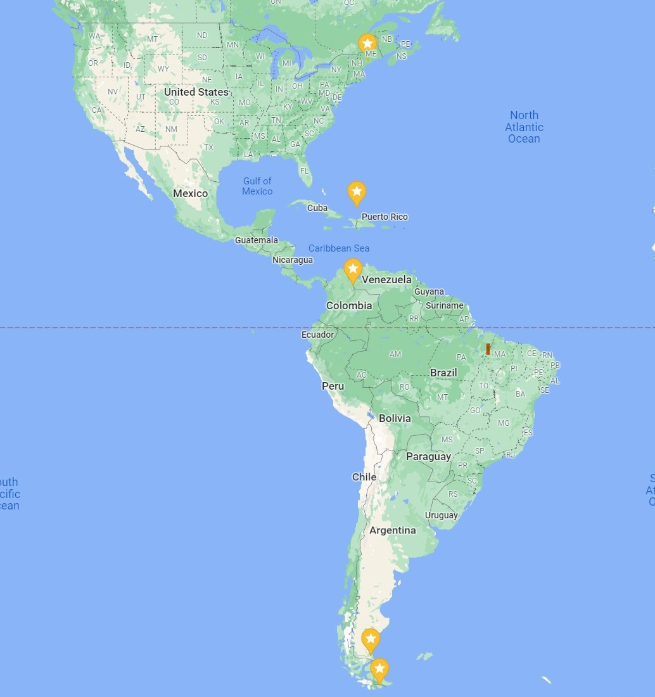

How to Access an API with RStudio
================
Autumn Biggie
10/3/2021

  - [Preliminary Steps](#preliminary-steps)
  - [Function to Access API](#function-to-access-api)
  - [Exploratory Data Analysis](#exploratory-data-analysis)
      - [Data Cleaning](#data-cleaning)
      - [Create New Variables](#create-new-variables)
      - [Contingency Tables](#contingency-tables)
      - [Numerical Summaries](#numerical-summaries)
      - [Data Visualization](#data-visualization)
  - [Final Thoughts](#final-thoughts)

In this document, we’ll walk through how to connect to an API, using an
example. The API we’ll be connecting to is the [OpenWeather
API](https://openweathermap.org/api). Specifically, we’ll be looking at
current and forecast weather data from the [One Call
API](https://openweathermap.org/api/one-call-api#history), one of the
many APIs that openweathermap.org offers.

## Preliminary Steps

1.  Many APIs require you to access the data using a unique API key. To
    acquire your free API key, register
    [here](https://home.openweathermap.org/users/sign_up).

2.  The following packages will be necessary in order to connect with
    the API:
    
      - `httr`  
      - `jsonlite`

3.  The following packages will be necessary in order to do some
    analyses after we load the data:
    
      - `tidyverse`  
      - `anytime`  
      - `ggplot2`
      - `chron`

## Function to Access API

Here, I’ve written a function `weather.api` to be able to easily access
the target API. The arguments are as follows:

  - `latitude`(required): latitude of the geographic location desired  
  - `longitude`(required): longitude of the geographic location
    desired  
  - `api.id`(required): input your unique API key here  
  - `exclude`(optional): list any parts of the weather data you want to
    exclude from the results. This should be a comma-delimited list,
    with or without spaces. Case is unimportant. The options are:
      - `current`  
      - `minutely`  
      - `hourly`  
      - `daily`  
  - `units` (optional): The unit of measurement in which values are
    returned. Options are:
      - `standard`  
      - `imperial`  
      - `metric`

Note: All parameters should be in character format i.e. `latitude =
"-46.05"`.

``` r
weather.api <- function(latitude, longitude, api.id, exclude = NULL, units = "metric") {
  
  #assign the individual pieces of the required url to their respective objects  
  base <- "https://api.openweathermap.org/data/2.5/onecall"
  lat1 <- "lat="
  lat2 <- latitude
  lon1 <- "lon="
  lon2 <- longitude
  exc1 <- "exclude="
  exc2 <- tolower(sub(" ", "", exclude)) #remove spaces and convert to lowercase  
  apid1 <- "appid="
  apid2 <- api.id
  units1 <- "units="
  units2 <- units
  
  #paste pieces together  
  lat <- paste(lat1, lat2, sep = "")
  lon <- paste(lon1, lon2, sep = "")  
  ifelse(!is.null(exc2), exc <- paste(exc1, exc2, sep = ""), exc <- "nullexclude")
  apid <- paste(apid1, apid2, sep = "")
  units <- paste(units1, units2, sep = "")
  
  #paste base and latitude pieces together  
  first <- paste(base, lat, sep = "?")
  
  #create the entire url by pasting all pieces together using delimiter "&", conditioning on if any information is excluded  
  ifelse(!is.null(exc2), my.url <- paste(first, lon, exc, apid, units, sep = "&"), my.url <- paste(first, lon, apid, units, sep = "&"))
  
  #access the Weather API using the URL assembled above
  weather.info <- GET(my.url)
  
  #convert the content of the accessed data from raw to character, then present in readable data frame format
  final <- weather.info$content %>% rawToChar() %>% fromJSON()

return(final)
}
```

## Exploratory Data Analysis

Now that we can easily access the API, let’s do some exploratory data
analysis.

I want to explore the weather data of five locations that lie roughly
along the same line of longitude.

Locations:

  - 44.19’N, 69.47’W (Augusta, Maine, US)  
  - 21.28’N, 71.08’W (Cockburn Town, Turks & Caicos Islands, UK)  
  - 7.54’N, 72.3’W (Cucata, Colombia)  
  - 51.38’S, 69.13’W (Rio Gallegos, Argentina)
  - 55.05’S, 67.05’W (Puerto Williams, Chile)

<!-- -->

``` r
Maine <- weather.api(latitude = "44.19", longitude = "-69.47", api.id = "input_your_key", exclude = "current, minutely, hourly")

Maine.day <- Maine$daily

Maine.day
```

    ##           dt    sunrise     sunset   moonrise    moonset
    ## 1 1633622400 1633603373 1633644485 1633607760 1633647660
    ## 2 1633708800 1633689846 1633730778 1633698900 1633735860
    ## 3 1633795200 1633776319 1633817071 1633790160 1633824300
    ## 4 1633881600 1633862792 1633903365 1633881360 1633913280
    ## 5 1633968000 1633949266 1633989660 1633972140 1634002920
    ## 6 1634054400 1634035740 1634075955 1634062320 1634093100
    ## 7 1634140800 1634122215 1634162251 1634151780 1634183700
    ## 8 1634227200 1634208690 1634248548 1634240580          0
    ##   moon_phase temp.day temp.min temp.max temp.night temp.eve
    ## 1       0.05    19.31     9.91    21.15      11.54    15.25
    ## 2       0.08    20.61    10.44    20.79      11.58    13.63
    ## 3       0.12    14.25     6.20    14.53       6.52     8.87
    ## 4       0.16    15.19     6.52    16.03      10.83    14.10
    ## 5       0.20    17.71    11.30    21.26      15.31    17.69
    ## 6       0.25    20.91    14.21    22.56      15.25    18.92
    ## 7       0.27    19.30    16.09    21.40      16.09    20.18
    ## 8       0.30    20.70    14.49    23.48      15.45    20.08
    ##   temp.morn feels_like.day feels_like.night feels_like.eve
    ## 1      9.91          19.05            11.20          15.00
    ## 2     10.44          20.16            10.36          13.06
    ## 3      6.32          13.11             6.52           7.87
    ## 4      6.74          14.41            10.53          13.60
    ## 5     11.30          17.49            15.46          17.71
    ## 6     14.21          20.88            15.39          18.93
    ## 7     16.83          19.77            16.29          20.60
    ## 8     14.49          20.71            15.37          20.18
    ##   feels_like.morn pressure humidity dew_point wind_speed
    ## 1            9.05     1025       67     13.04       2.13
    ## 2            9.84     1023       55     11.03       5.02
    ## 3            5.00     1031       53      4.48       3.10
    ## 4            6.74     1029       63      7.99       3.41
    ## 5           11.04     1022       75     12.99       4.22
    ## 6           14.25     1019       70     15.11       3.54
    ## 7           17.15     1014       95     18.19       1.97
    ## 8           14.53     1015       72     15.29       2.12
    ##   wind_deg wind_gust                           weather
    ## 1      195      3.03        800, Clear, clear sky, 01d
    ## 2      112      9.01 804, Clouds, overcast clouds, 04d
    ## 3      153      7.03      801, Clouds, few clouds, 02d
    ## 4      204      7.59 804, Clouds, overcast clouds, 04d
    ## 5      217     11.24 804, Clouds, overcast clouds, 04d
    ## 6      214     10.62 804, Clouds, overcast clouds, 04d
    ## 7      343      7.42        500, Rain, light rain, 10d
    ## 8      358      7.65      801, Clouds, few clouds, 02d
    ##   clouds  pop  uvi rain
    ## 1      5 0.00 3.85   NA
    ## 2     93 0.00 3.83   NA
    ## 3     18 0.00 3.60   NA
    ## 4    100 0.00 3.30   NA
    ## 5     96 0.00 0.21   NA
    ## 6    100 0.00 1.00   NA
    ## 7    100 1.00 1.00 7.86
    ## 8     19 0.09 1.00   NA

### Data Cleaning

Let’s convert all dates/times that are in unix form to a date/time
stamp.

``` r
Maine.day$dt <- anydate(Maine.day$dt)
Maine.day$sunrise <- anytime(Maine.day$sunrise)
Maine.day$sunset <- anytime(Maine.day$sunset)
Maine.day$moonrise <- anytime(Maine.day$moonrise)
Maine.day$moonset <- anytime(Maine.day$moonset)
```

Convert the `dt` variable into three variables, `Year`, `Month`, `Day`,
and then change `sunrise`, `sunset`, `moonrise`, and `moonset` to only
include timestamps.

``` r
Maine.day <- Maine.day %>% separate(dt, c("Year", "Month", "Day"), sep = "-", convert = TRUE, remove = TRUE)

#change sunrise, sunset, moonrise, and moonset to only include timestamps

Maine.day <- Maine.day %>% separate(sunrise, c("Date", "Sunrise"), sep = " ", remove = TRUE) %>% subset(select = -Date)

Maine.day <- Maine.day %>% separate(sunset, c("Date", "Sunset"), sep = " ", remove = TRUE) %>% subset(select = -Date)

Maine.day <- Maine.day %>% separate(moonrise, c("Date", "Moonrise"), sep = " ", remove = TRUE) %>% subset(select = -Date)

Maine.day <- Maine.day %>% separate(moonset, c("Date", "Moonset"), sep = " ", remove = TRUE) %>% subset(select = -Date)
```

Lastly, combine the nested `temp` dataframe with `Maine.day` to create a
new dataframe called `Maine.day1`, removing unwanted variables.

``` r
Maine.day1 <- data.frame(Maine.day, Maine.day$temp) %>% select(Year:moon_phase, pressure:wind_gust, clouds, pop, min, max) %>% rename(mintemp = min, maxtemp = max)

Maine.day1
```

    ##   Year Month Day  Sunrise   Sunset Moonrise  Moonset
    ## 1 2021    10   7 06:42:53 18:08:05 07:56:00 19:01:00
    ## 2 2021    10   8 06:44:06 18:06:18 09:15:00 19:31:00
    ## 3 2021    10   9 06:45:19 18:04:31 10:36:00 20:05:00
    ## 4 2021    10  10 06:46:32 18:02:45 11:56:00 20:48:00
    ## 5 2021    10  11 06:47:46 18:01:00 13:09:00 21:42:00
    ## 6 2021    10  12 06:49:00 17:59:15 14:12:00 22:45:00
    ## 7 2021    10  13 06:50:15 17:57:31 15:03:00 23:55:00
    ## 8 2021    10  14 06:51:30 17:55:48 15:43:00 19:00:00
    ##   moon_phase pressure humidity dew_point wind_speed wind_deg
    ## 1       0.05     1025       67     13.04       2.13      195
    ## 2       0.08     1023       55     11.03       5.02      112
    ## 3       0.12     1031       53      4.48       3.10      153
    ## 4       0.16     1029       63      7.99       3.41      204
    ## 5       0.20     1022       75     12.99       4.22      217
    ## 6       0.25     1019       70     15.11       3.54      214
    ## 7       0.27     1014       95     18.19       1.97      343
    ## 8       0.30     1015       72     15.29       2.12      358
    ##   wind_gust clouds  pop mintemp maxtemp
    ## 1      3.03      5 0.00    9.91   21.15
    ## 2      9.01     93 0.00   10.44   20.79
    ## 3      7.03     18 0.00    6.20   14.53
    ## 4      7.59    100 0.00    6.52   16.03
    ## 5     11.24     96 0.00   11.30   21.26
    ## 6     10.62    100 0.00   14.21   22.56
    ## 7      7.42    100 1.00   16.09   21.40
    ## 8      7.65     19 0.09   14.49   23.48

Awesome\! Remember to clean the data returned from the other locations
too.

Now, let’s combine all datasets into one called `weather`, creating a
new variable called `location`.

``` r
Maine.day1 <- Maine.day1 %>% mutate(location = "Maine, US")
Turks.day1 <- Turks.day1 %>% mutate(location = "Turks & Caicos")
Colombia.day1 <- Colombia.day1 %>% mutate(location = "Colombia")
Chile.day1 <- Chile.day1 %>% mutate(location = "Chile")
Argentina.day1 <- Argentina.day1 %>% mutate(location = "Argentina")

weather <- rbind(Maine.day1, Turks.day1, Colombia.day1, Argentina.day1, Chile.day1) %>% relocate(location, .before = Year)
```

### Create New Variables

I’m interested in converting `humidity` and `clouds` into categorical
variables with different levels.

I’ll begin with humidity. Lets say that if humidity is less than or
equal to 60, there is low humidity, if 60 \< humidity is less than or
equal to 80, there is medium humidity, and if humidity \> 80, there is
high humidity.

``` r
weather <- weather %>% mutate(humidity.status = as.factor(ifelse(humidity > 80, "High", ifelse(humidity >60, "Medium", "Low"))))

weather$humidity.status <- ordered(weather$humidity.status, levels = c("Low", "Medium", "High"))
```

Great\! Now let’s look at `clouds`. If clouds is less than or equal to
25, then cloud coverage is low. If clouds \> 75 then cloud coverage is
high, and anything in between is medium.

``` r
weather <- weather %>% mutate(cloud.coverage = as.factor(ifelse(clouds > 75, "High", ifelse(clouds > 25, "Medium", "Low"))))

weather$cloud.coverage <- ordered(weather$cloud.coverage, levels = c("Low", "Medium", "High"))
```

Here’s our cleaned dataset:

``` r
weather
```

    ##          location Year Month Day  Sunrise   Sunset Moonrise
    ## 1       Maine, US 2021    10   7 06:42:53 18:08:05 07:56:00
    ## 2       Maine, US 2021    10   8 06:44:06 18:06:18 09:15:00
    ## 3       Maine, US 2021    10   9 06:45:19 18:04:31 10:36:00
    ## 4       Maine, US 2021    10  10 06:46:32 18:02:45 11:56:00
    ## 5       Maine, US 2021    10  11 06:47:46 18:01:00 13:09:00
    ## 6       Maine, US 2021    10  12 06:49:00 17:59:15 14:12:00
    ## 7       Maine, US 2021    10  13 06:50:15 17:57:31 15:03:00
    ## 8       Maine, US 2021    10  14 06:51:30 17:55:48 15:43:00
    ## 9  Turks & Caicos 2021    10   7 06:37:11 18:26:40 07:42:00
    ## 10 Turks & Caicos 2021    10   8 06:37:29 18:25:47 08:45:00
    ## 11 Turks & Caicos 2021    10   9 06:37:48 18:24:55 09:51:00
    ## 12 Turks & Caicos 2021    10  10 06:38:08 18:24:02 10:58:00
    ## 13 Turks & Caicos 2021    10  11 06:38:27 18:23:11 12:03:00
    ## 14 Turks & Caicos 2021    10  12 06:38:48 18:22:20 13:06:00
    ## 15 Turks & Caicos 2021    10  13 06:39:08 18:21:30 14:02:00
    ## 16 Turks & Caicos 2021    10  14 06:39:30 18:20:41 14:52:00
    ## 17       Colombia 2021    10   7 06:36:26 18:37:10 07:38:00
    ## 18       Colombia 2021    10   8 06:36:21 18:36:41 08:34:00
    ## 19       Colombia 2021    10   9 06:36:16 18:36:12 09:34:00
    ## 20       Colombia 2021    10  10 06:36:12 18:35:43 10:35:00
    ## 21       Colombia 2021    10  11 06:36:08 18:35:16 11:39:00
    ## 22       Colombia 2021    10  12 06:36:05 18:34:48 12:40:00
    ## 23       Colombia 2021    10  13 06:36:02 18:34:22 13:39:00
    ## 24       Colombia 2021    10  14 06:36:00 18:33:56 14:33:00
    ## 25      Argentina 2021    10   7 05:50:17 18:57:58 06:40:00
    ## 26      Argentina 2021    10   8 05:48:02 18:59:38 06:59:00
    ## 27      Argentina 2021    10   9 05:45:48 19:01:19 07:22:00
    ## 28      Argentina 2021    10  10 05:43:34 19:03:00 07:54:00
    ## 29      Argentina 2021    10  11 05:41:21 19:04:41 08:37:00
    ## 30      Argentina 2021    10  12 05:39:09 19:06:23 09:34:00
    ## 31      Argentina 2021    10  13 05:36:57 19:08:05 10:44:00
    ## 32      Argentina 2021    10  14 05:34:47 19:09:48 12:01:00
    ## 33          Chile 2021    10   7 05:37:23 18:54:14 06:25:00
    ## 34          Chile 2021    10   8 05:34:51 18:56:11 06:40:00
    ## 35          Chile 2021    10   9 05:32:20 18:58:09 06:58:00
    ## 36          Chile 2021    10  10 05:29:49 19:00:07 07:24:00
    ## 37          Chile 2021    10  11 05:27:18 19:02:06 08:02:00
    ## 38          Chile 2021    10  12 05:24:49 19:04:05 08:57:00
    ## 39          Chile 2021    10  13 05:22:19 19:06:05 10:09:00
    ## 40          Chile 2021    10  14 05:19:51 19:08:05 11:31:00
    ##     Moonset moon_phase pressure humidity dew_point
    ## 1  19:01:00       0.05     1025       67     13.04
    ## 2  19:31:00       0.08     1023       55     11.03
    ## 3  20:05:00       0.12     1031       53      4.48
    ## 4  20:48:00       0.16     1029       63      7.99
    ## 5  21:42:00       0.20     1022       75     12.99
    ## 6  22:45:00       0.25     1019       70     15.11
    ## 7  23:55:00       0.27     1014       95     18.19
    ## 8  19:00:00       0.30     1015       72     15.29
    ## 9  19:35:00       0.05     1017       71     23.09
    ## 10 20:19:00       0.08     1014       76     23.56
    ## 11 21:09:00       0.12     1014       75     23.64
    ## 12 22:03:00       0.16     1014       77     24.17
    ## 13 23:02:00       0.20     1015       76     23.87
    ## 14 19:00:00       0.25     1015       78     24.19
    ## 15 00:04:00       0.27     1013       82     21.66
    ## 16 01:06:00       0.30     1010       80     23.62
    ## 17 19:52:00       0.05     1015       54     13.41
    ## 18 20:43:00       0.08     1015       74     15.43
    ## 19 21:38:00       0.12     1014       64     14.83
    ## 20 22:36:00       0.16     1016       64     13.61
    ## 21 23:38:00       0.20     1015       73     15.74
    ## 22 19:00:00       0.25     1016       73     15.69
    ## 23 00:38:00       0.27     1015       73     15.59
    ## 24 01:38:00       0.30     1014       72     16.14
    ## 25 20:46:00       0.04     1015       53      0.22
    ## 26 22:15:00       0.08     1005       56      0.80
    ## 27 19:00:00       0.12     1001       44      3.13
    ## 28 23:43:00       0.16     1008       52     -1.07
    ## 29 01:07:00       0.19     1005       37     -4.39
    ## 30 02:18:00       0.23     1001       40     -1.60
    ## 31 03:13:00       0.25      987       45     -1.19
    ## 32 03:53:00       0.30      988       36     -6.64
    ## 33 20:47:00       0.04     1008       54     -1.26
    ## 34 22:21:00       0.08      992       71     -0.86
    ## 35 19:00:00       0.12      994       66      1.87
    ## 36 23:56:00       0.16     1000       54     -1.56
    ## 37 01:23:00       0.19      998       74      2.30
    ## 38 02:37:00       0.23     1000       50      0.82
    ## 39 03:30:00       0.25      981       65      1.20
    ## 40 04:06:00       0.30      982       72     -1.37
    ##    wind_speed wind_deg wind_gust clouds  pop mintemp maxtemp
    ## 1        2.13      195      3.03      5 0.00    9.91   21.15
    ## 2        5.02      112      9.01     93 0.00   10.44   20.79
    ## 3        3.10      153      7.03     18 0.00    6.20   14.53
    ## 4        3.41      204      7.59    100 0.00    6.52   16.03
    ## 5        4.22      217     11.24     96 0.00   11.30   21.26
    ## 6        3.54      214     10.62    100 0.00   14.21   22.56
    ## 7        1.97      343      7.42    100 1.00   16.09   21.40
    ## 8        2.12      358      7.65     19 0.09   14.49   23.48
    ## 9        9.85       73     10.56     32 0.94   27.86   29.01
    ## 10       8.02       81      8.33      4 0.78   27.69   28.28
    ## 11       7.95      107      8.29     12 0.76   27.85   28.54
    ## 12       9.35      113     10.22     74 0.57   27.97   28.65
    ## 13       9.18       92     10.04     21 0.22   28.12   28.59
    ## 14       9.29       88     10.56    100 1.00   27.28   28.35
    ## 15      15.50       85     17.47    100 1.00   24.90   27.33
    ## 16      10.23      117     10.94     97 0.96   26.87   27.45
    ## 17       3.22      110      4.69     79 1.00   12.00   23.57
    ## 18       2.07      108      3.15     76 1.00   12.70   19.31
    ## 19       2.13       81      2.65     69 1.00   13.33   20.96
    ## 20       1.73       99      2.52     84 1.00   13.52   20.05
    ## 21       2.24      103      3.17     81 1.00   13.09   20.05
    ## 22       2.38      100      3.16     95 1.00   13.25   20.16
    ## 23       1.86       89      2.43     95 0.99   13.91   19.55
    ## 24       1.57       59      2.32     99 1.00   13.30   20.20
    ## 25      12.48      238     17.91    100 0.00    2.77    9.70
    ## 26      15.76      237     20.20     81 0.00    4.77   12.19
    ## 27      12.55      316     19.46    100 0.00    3.92   16.86
    ## 28      11.95      246     18.01     91 0.23    4.57   12.31
    ## 29       6.26      354      8.18     83 0.00    4.87   12.95
    ## 30       8.90      311     14.76     48 0.00    6.11   14.42
    ## 31      12.04      340     19.46     25 0.00    7.47   11.88
    ## 32      13.97      255     17.83      3 0.28    3.48    7.50
    ## 33       8.29      227     15.59    100 0.63    1.91    8.52
    ## 34      13.01      262     24.04     84 0.80    4.22    9.04
    ## 35      11.15      342     23.77    100 0.56    2.37    9.52
    ## 36       8.61      325     15.78      1 0.67    3.33    9.11
    ## 37       8.93      328     16.99    100 0.21    4.85    9.80
    ## 38       7.10      346     13.10     55 0.00    4.14   11.75
    ## 39      10.27      339     18.34    100 0.25    5.37   10.91
    ## 40       6.27      334     12.95    100 0.94   -0.21    5.28
    ##    humidity.status cloud.coverage
    ## 1           Medium            Low
    ## 2              Low           High
    ## 3              Low            Low
    ## 4           Medium           High
    ## 5           Medium           High
    ## 6           Medium           High
    ## 7             High           High
    ## 8           Medium            Low
    ## 9           Medium         Medium
    ## 10          Medium            Low
    ## 11          Medium            Low
    ## 12          Medium         Medium
    ## 13          Medium            Low
    ## 14          Medium           High
    ## 15            High           High
    ## 16          Medium           High
    ## 17             Low           High
    ## 18          Medium           High
    ## 19          Medium         Medium
    ## 20          Medium           High
    ## 21          Medium           High
    ## 22          Medium           High
    ## 23          Medium           High
    ## 24          Medium           High
    ## 25             Low           High
    ## 26             Low           High
    ## 27             Low           High
    ## 28             Low           High
    ## 29             Low           High
    ## 30             Low         Medium
    ## 31             Low            Low
    ## 32             Low            Low
    ## 33             Low           High
    ## 34          Medium           High
    ## 35          Medium           High
    ## 36             Low            Low
    ## 37          Medium           High
    ## 38             Low         Medium
    ## 39          Medium           High
    ## 40          Medium           High

### Contingency Tables

With the new categorical variables I’ve created, let’s create some
contingency tables. `tabz1` will show the counts of observations within
each level combination of `cloud.coverage` and `humidity.status`.

``` r
tabz1 <- table(weather$humidity.status, weather$cloud.coverage, deparse.level = 2)

tabz1
```

    ##                        weather$cloud.coverage
    ## weather$humidity.status Low Medium High
    ##                  Low      4      2    8
    ##                  Medium   5      3   16
    ##                  High     0      0    2

It looks like there were 8 forecast observations that predicted high
cloud coverage and low humidity, and 16 observations that predicted high
cloud coverage and medium humidity. There weren’t many observations that
predicted high humidity, but it appears that when high humidity was
predicted, it was most often coupled with high cloud coverage.

`tabz2` will show the counts of days within each level combination of
`cloud.coverage` and `humidity.status`, separated by `location`.

``` r
tabz2 <- table(weather$humidity.status, weather$cloud.coverage, weather$location, deparse.level = 2)

tabz2
```

    ## , , weather$location = Argentina
    ## 
    ##                        weather$cloud.coverage
    ## weather$humidity.status Low Medium High
    ##                  Low      2      1    5
    ##                  Medium   0      0    0
    ##                  High     0      0    0
    ## 
    ## , , weather$location = Chile
    ## 
    ##                        weather$cloud.coverage
    ## weather$humidity.status Low Medium High
    ##                  Low      1      1    1
    ##                  Medium   0      0    5
    ##                  High     0      0    0
    ## 
    ## , , weather$location = Colombia
    ## 
    ##                        weather$cloud.coverage
    ## weather$humidity.status Low Medium High
    ##                  Low      0      0    1
    ##                  Medium   0      1    6
    ##                  High     0      0    0
    ## 
    ## , , weather$location = Maine, US
    ## 
    ##                        weather$cloud.coverage
    ## weather$humidity.status Low Medium High
    ##                  Low      1      0    1
    ##                  Medium   2      0    3
    ##                  High     0      0    1
    ## 
    ## , , weather$location = Turks & Caicos
    ## 
    ##                        weather$cloud.coverage
    ## weather$humidity.status Low Medium High
    ##                  Low      0      0    0
    ##                  Medium   3      2    2
    ##                  High     0      0    1

This table gives us an idea of how the relationship between humidity
status and cloud coverage can change based on location. An observation
to note is that the locations in Chile and Argentina, which are close to
the south pole, most often have medium humidity and high cloud coverage
or low humidity and high cloud coverage, respectively. I’d be interested
to find out why this is the case, or if the data only appears this way
because we’re not working with many observations. It makes sense that
Puerto Williams, Chile would have higher humidity than the Argentina
location because it is a costal city.

### Numerical Summaries

Now that we’ve explored our categorical variables, let’s take a look at
some numeric summaries.

The table below lists the average maximum temperature, average minimum
temperature, their respective standard deviations, and the interquartile
range for each location.

``` r
weather$location <- ordered(weather$location, levels = c("Chile", "Argentina", "Colombia", "Turks & Caicos", "Maine, US")) #convert location into an ordered variable

weather %>% group_by(location) %>% summarise(avghigh = mean(maxtemp), avglow = mean(mintemp), sdhigh = sd(maxtemp), sdlow = sd(mintemp), IQR = IQR(maxtemp))
```

    ## # A tibble: 5 x 6
    ##   location       avghigh avglow sdhigh sdlow   IQR
    ##   <ord>            <dbl>  <dbl>  <dbl> <dbl> <dbl>
    ## 1 Chile             9.24   3.25  1.92  1.83  1.17 
    ## 2 Argentina        12.2    4.74  2.82  1.49  1.98 
    ## 3 Colombia         20.5   13.1   1.34  0.574 0.465
    ## 4 Turks & Caicos   28.3   27.3   0.589 1.06  0.532
    ## 5 Maine, US        20.2   11.1   3.15  3.64  2.09

It’s clear that the average high and average low peak near the middle of
the globe, with greater variation near the poles. These numbers could
not only be affected by latitude, but also by elevation.

Now we’ll look at the average humidity forecasted for each location, as
well as their standard deviations.

``` r
weather %>% group_by(location) %>% summarise(avg_humidity = mean(humidity), sd.humidity = sd(humidity))
```

    ## # A tibble: 5 x 3
    ##   location       avg_humidity sd.humidity
    ##   <ord>                 <dbl>       <dbl>
    ## 1 Chile                  63.2        9.33
    ## 2 Argentina              45.4        7.60
    ## 3 Colombia               68.4        7.11
    ## 4 Turks & Caicos         76.9        3.31
    ## 5 Maine, US              68.8       13.2

Here we see a clear relationship between location (organized by
latitude) and humidity. The locations nearest to the poles generally
have the lowest humidity, but the Turks and Caicos Islands as well as
the Chile location have the highest humidity, most likely because they
are close to or in the ocean.

### Data Visualization

Now I’ll use some tools for visualizing the data we’ve collected from
the API.

Let’s visualize the second contingency table we made above using a bar
graph with `humidity.status` and `cloud.coverage`, separating the
results by `location`.

``` r
sum.tab <- weather %>% group_by(location, humidity.status, cloud.coverage) %>% summarise(count = n())

g6 <- ggplot(sum.tab, aes(x = humidity.status, y = count))

g6 + geom_bar(aes(fill = cloud.coverage), stat = "identity", position = "dodge") + facet_wrap(~ location) + labs(title = "8 Day Forecast: Humidity Status vs. Cloud Coverage by Location", x = "Humidity Status") + scale_fill_discrete(name = "Cloud Coverage") + theme(axis.text.x = element_text(angle = 45, vjust = .8, hjust = 1))
```

<!-- -->

Here we can see the observation we made earlier about Chile and
Argentina having high cloud coverage, but most often medium or low
humidity, respectively. In addition, it’s also easier to see that the
forecast for Colombia most often includes medium humidity and high cloud
coverage. A puzzling observation is that Turks and Caicos always has
medium humidity, but either low or high cloud coverage.

Next, I’ll look at how location affects minimum and maximum daily
temperature using boxplots.

``` r
max.means <- weather %>% group_by(location) %>% summarise(average = mean(maxtemp)) 

g <- ggplot(weather, aes(x = location, y = maxtemp))

g + geom_boxplot(fill = "grey") + geom_point(max.means, mapping = aes(x = location, y = average), color = "purple") + geom_line(max.means, mapping = aes(x = location, y = average, group = 1), color = "purple") + labs(title = "8 Day Forecast: Maximum Daily Temperature",x = "Location (highest to lowest latitude)", y = "Maximum Daily Temperature (C)") + coord_flip()
```

<!-- -->

``` r
min.means <- weather %>% group_by(location) %>% summarise(average = mean(mintemp))

g1 <- ggplot(weather, aes(x = location, y = mintemp))

g1 + geom_boxplot(fill = "grey") + geom_point(min.means, mapping = aes(x = location, y = average), color = "green") + geom_line(min.means, mapping = aes(x = location, y = average, group = 1), color = "green") + labs(title = "8 Day Forecast: Minimum Daily Temperature", x = "Location (highest to lowest latitude)", y = "Minimum Daily Temperature (C)") + coord_flip()
```

<!-- -->

Both boxplots are fairly consistent with each other, showing Turks and
Caicos as having the highest minimum and maximum temperature, and
locations at the highest and lowest latitudes as having the lowest
minimum and maximum temperatures. Although Cucata, Colombia is closer to
the equator than Turks and Caicos Islands, a possible reason as to why
it may not be warmer is its elevation at 320 meters (1,050 ft).

Now we’ll turn to exploring `humidity` as a quantitative variable,
creating a histogram with density plots of `humidity` facetted by
`location`. We’ll also create a boxplot of the same information.

``` r
g2 <- ggplot(weather, aes(x = humidity))

g2 + geom_histogram(bins = 20, aes(y = ..density..)) + geom_density(color = "aquamarine", fill = "aquamarine") + facet_wrap(~location) + labs(title = "8 Day Forecast: Histogram of Humidity by Location", x = "Humidity (%)")
```

<!-- -->

``` r
hum.means <- weather %>% group_by(location) %>% summarise(average = mean(humidity))

g3 <- ggplot(weather, aes(x = location, y = humidity))

g3 + geom_boxplot(fill = "grey") + geom_point(hum.means, mapping = aes(x = location, y = average), color = "red") + geom_line(hum.means, mapping = aes(x = location, y = average, group = 1), color = "red") + labs(title = "8 Day Forecast: Average Daily Humidity by Location", x = "Location (highest to lowest latitude)", y = "Average Daily Humidity (C)") + coord_flip()
```

<!-- -->

This histogram and boxplot are very helpful in displaying how humidity
varies by location. Generally, it looks like humidity follows a similar
trend to temperature, varying with latitude. However, it’s clear that
the cities closest to the ocean (Turks & Caicos and Puerto Williams,
Chile) display higher humidity levels than expected if `humidity.status`
only depended on latitude.

To prepare for the next plot, I’ll convert all variables with timestamps
to numeric variables of time since 00:00:00, calculated in minutes.

``` r
weather$Sunrise <- round(60 * 24 * as.numeric(times(weather$Sunrise)),digits = 2)

weather$Sunset <- round(60 * 24 * as.numeric(times(weather$Sunset)),digits = 2)

weather$Moonrise <- round(60 * 24 * as.numeric(times(weather$Moonrise)), digits = 2)

weather$Moonset <- round(60 * 24 * as.numeric(times(weather$Moonset)), digits = 2)

weather
```

    ##          location Year Month Day Sunrise  Sunset Moonrise
    ## 1       Maine, US 2021    10   7  402.88 1088.08      476
    ## 2       Maine, US 2021    10   8  404.10 1086.30      555
    ## 3       Maine, US 2021    10   9  405.32 1084.52      636
    ## 4       Maine, US 2021    10  10  406.53 1082.75      716
    ## 5       Maine, US 2021    10  11  407.77 1081.00      789
    ## 6       Maine, US 2021    10  12  409.00 1079.25      852
    ## 7       Maine, US 2021    10  13  410.25 1077.52      903
    ## 8       Maine, US 2021    10  14  411.50 1075.80      943
    ## 9  Turks & Caicos 2021    10   7  397.18 1106.67      462
    ## 10 Turks & Caicos 2021    10   8  397.48 1105.78      525
    ## 11 Turks & Caicos 2021    10   9  397.80 1104.92      591
    ## 12 Turks & Caicos 2021    10  10  398.13 1104.03      658
    ## 13 Turks & Caicos 2021    10  11  398.45 1103.18      723
    ## 14 Turks & Caicos 2021    10  12  398.80 1102.33      786
    ## 15 Turks & Caicos 2021    10  13  399.13 1101.50      842
    ## 16 Turks & Caicos 2021    10  14  399.50 1100.68      892
    ## 17       Colombia 2021    10   7  396.43 1117.17      458
    ## 18       Colombia 2021    10   8  396.35 1116.68      514
    ## 19       Colombia 2021    10   9  396.27 1116.20      574
    ## 20       Colombia 2021    10  10  396.20 1115.72      635
    ## 21       Colombia 2021    10  11  396.13 1115.27      699
    ## 22       Colombia 2021    10  12  396.08 1114.80      760
    ## 23       Colombia 2021    10  13  396.03 1114.37      819
    ## 24       Colombia 2021    10  14  396.00 1113.93      873
    ## 25      Argentina 2021    10   7  350.28 1137.97      400
    ## 26      Argentina 2021    10   8  348.03 1139.63      419
    ## 27      Argentina 2021    10   9  345.80 1141.32      442
    ## 28      Argentina 2021    10  10  343.57 1143.00      474
    ## 29      Argentina 2021    10  11  341.35 1144.68      517
    ## 30      Argentina 2021    10  12  339.15 1146.38      574
    ## 31      Argentina 2021    10  13  336.95 1148.08      644
    ## 32      Argentina 2021    10  14  334.78 1149.80      721
    ## 33          Chile 2021    10   7  337.38 1134.23      385
    ## 34          Chile 2021    10   8  334.85 1136.18      400
    ## 35          Chile 2021    10   9  332.33 1138.15      418
    ## 36          Chile 2021    10  10  329.82 1140.12      444
    ## 37          Chile 2021    10  11  327.30 1142.10      482
    ## 38          Chile 2021    10  12  324.82 1144.08      537
    ## 39          Chile 2021    10  13  322.32 1146.08      609
    ## 40          Chile 2021    10  14  319.85 1148.08      691
    ##    Moonset moon_phase pressure humidity dew_point wind_speed
    ## 1     1141       0.05     1025       67     13.04       2.13
    ## 2     1171       0.08     1023       55     11.03       5.02
    ## 3     1205       0.12     1031       53      4.48       3.10
    ## 4     1248       0.16     1029       63      7.99       3.41
    ## 5     1302       0.20     1022       75     12.99       4.22
    ## 6     1365       0.25     1019       70     15.11       3.54
    ## 7     1435       0.27     1014       95     18.19       1.97
    ## 8     1140       0.30     1015       72     15.29       2.12
    ## 9     1175       0.05     1017       71     23.09       9.85
    ## 10    1219       0.08     1014       76     23.56       8.02
    ## 11    1269       0.12     1014       75     23.64       7.95
    ## 12    1323       0.16     1014       77     24.17       9.35
    ## 13    1382       0.20     1015       76     23.87       9.18
    ## 14    1140       0.25     1015       78     24.19       9.29
    ## 15       4       0.27     1013       82     21.66      15.50
    ## 16      66       0.30     1010       80     23.62      10.23
    ## 17    1192       0.05     1015       54     13.41       3.22
    ## 18    1243       0.08     1015       74     15.43       2.07
    ## 19    1298       0.12     1014       64     14.83       2.13
    ## 20    1356       0.16     1016       64     13.61       1.73
    ## 21    1418       0.20     1015       73     15.74       2.24
    ## 22    1140       0.25     1016       73     15.69       2.38
    ## 23      38       0.27     1015       73     15.59       1.86
    ## 24      98       0.30     1014       72     16.14       1.57
    ## 25    1246       0.04     1015       53      0.22      12.48
    ## 26    1335       0.08     1005       56      0.80      15.76
    ## 27    1140       0.12     1001       44      3.13      12.55
    ## 28    1423       0.16     1008       52     -1.07      11.95
    ## 29      67       0.19     1005       37     -4.39       6.26
    ## 30     138       0.23     1001       40     -1.60       8.90
    ## 31     193       0.25      987       45     -1.19      12.04
    ## 32     233       0.30      988       36     -6.64      13.97
    ## 33    1247       0.04     1008       54     -1.26       8.29
    ## 34    1341       0.08      992       71     -0.86      13.01
    ## 35    1140       0.12      994       66      1.87      11.15
    ## 36    1436       0.16     1000       54     -1.56       8.61
    ## 37      83       0.19      998       74      2.30       8.93
    ## 38     157       0.23     1000       50      0.82       7.10
    ## 39     210       0.25      981       65      1.20      10.27
    ## 40     246       0.30      982       72     -1.37       6.27
    ##    wind_deg wind_gust clouds  pop mintemp maxtemp
    ## 1       195      3.03      5 0.00    9.91   21.15
    ## 2       112      9.01     93 0.00   10.44   20.79
    ## 3       153      7.03     18 0.00    6.20   14.53
    ## 4       204      7.59    100 0.00    6.52   16.03
    ## 5       217     11.24     96 0.00   11.30   21.26
    ## 6       214     10.62    100 0.00   14.21   22.56
    ## 7       343      7.42    100 1.00   16.09   21.40
    ## 8       358      7.65     19 0.09   14.49   23.48
    ## 9        73     10.56     32 0.94   27.86   29.01
    ## 10       81      8.33      4 0.78   27.69   28.28
    ## 11      107      8.29     12 0.76   27.85   28.54
    ## 12      113     10.22     74 0.57   27.97   28.65
    ## 13       92     10.04     21 0.22   28.12   28.59
    ## 14       88     10.56    100 1.00   27.28   28.35
    ## 15       85     17.47    100 1.00   24.90   27.33
    ## 16      117     10.94     97 0.96   26.87   27.45
    ## 17      110      4.69     79 1.00   12.00   23.57
    ## 18      108      3.15     76 1.00   12.70   19.31
    ## 19       81      2.65     69 1.00   13.33   20.96
    ## 20       99      2.52     84 1.00   13.52   20.05
    ## 21      103      3.17     81 1.00   13.09   20.05
    ## 22      100      3.16     95 1.00   13.25   20.16
    ## 23       89      2.43     95 0.99   13.91   19.55
    ## 24       59      2.32     99 1.00   13.30   20.20
    ## 25      238     17.91    100 0.00    2.77    9.70
    ## 26      237     20.20     81 0.00    4.77   12.19
    ## 27      316     19.46    100 0.00    3.92   16.86
    ## 28      246     18.01     91 0.23    4.57   12.31
    ## 29      354      8.18     83 0.00    4.87   12.95
    ## 30      311     14.76     48 0.00    6.11   14.42
    ## 31      340     19.46     25 0.00    7.47   11.88
    ## 32      255     17.83      3 0.28    3.48    7.50
    ## 33      227     15.59    100 0.63    1.91    8.52
    ## 34      262     24.04     84 0.80    4.22    9.04
    ## 35      342     23.77    100 0.56    2.37    9.52
    ## 36      325     15.78      1 0.67    3.33    9.11
    ## 37      328     16.99    100 0.21    4.85    9.80
    ## 38      346     13.10     55 0.00    4.14   11.75
    ## 39      339     18.34    100 0.25    5.37   10.91
    ## 40      334     12.95    100 0.94   -0.21    5.28
    ##    humidity.status cloud.coverage
    ## 1           Medium            Low
    ## 2              Low           High
    ## 3              Low            Low
    ## 4           Medium           High
    ## 5           Medium           High
    ## 6           Medium           High
    ## 7             High           High
    ## 8           Medium            Low
    ## 9           Medium         Medium
    ## 10          Medium            Low
    ## 11          Medium            Low
    ## 12          Medium         Medium
    ## 13          Medium            Low
    ## 14          Medium           High
    ## 15            High           High
    ## 16          Medium           High
    ## 17             Low           High
    ## 18          Medium           High
    ## 19          Medium         Medium
    ## 20          Medium           High
    ## 21          Medium           High
    ## 22          Medium           High
    ## 23          Medium           High
    ## 24          Medium           High
    ## 25             Low           High
    ## 26             Low           High
    ## 27             Low           High
    ## 28             Low           High
    ## 29             Low           High
    ## 30             Low         Medium
    ## 31             Low            Low
    ## 32             Low            Low
    ## 33             Low           High
    ## 34          Medium           High
    ## 35          Medium           High
    ## 36             Low            Low
    ## 37          Medium           High
    ## 38             Low         Medium
    ## 39          Medium           High
    ## 40          Medium           High

The scatterplot below allows us to look at how sunrise time changes over
the course of 8 days in each location.

``` r
g4 <- ggplot(weather, aes(x = Day, y = Sunrise))

g4 + geom_point(aes(color = location), size = 2) + scale_color_discrete(name = "Location") + labs(title = "8 Day Forecast for Sunrise Time by Location", x = "Day of the Month", y = "Sunrise Time (minutes after 12am)")
```

<!-- -->

I think this plot is especially cool to look at, since one can clearly
distinguish which locations are in the southern hemisphere, and which
are in the northern hemisphere. While the sun is rising increasingly
later in the northern hemisphere, it’s rising increasingly earlier in
the southern hemisphere.

Lastly, we’ll explore the relationship between maximum daily temperature
and daily pressure in the scatterplot below.

``` r
g5 <- ggplot(weather, aes(x = maxtemp, y = pressure))

g5 + geom_point(aes(color = location), size = 2) + geom_smooth(method = lm, formula = y~poly(x,2), color = "black") + scale_color_discrete(name = "Location") + labs(title = "8 Day Forecast: Maximum Daily Temperature vs. Daily Pressure", x = "Maximum Daily Temperature (C)", y = "Daily Pressure (millibars)") + scale_size_continuous()
```

<!-- -->

There seems to be a medium-strength positive relationship between
temperature and pressure. However, the data from the Turks and Caicos
Islands appears to deviate slightly from the general trend, which is why
I decided to fit a quadratic model. To fit a more accurate model, we may
need to pull data from more locations from the API.

## Final Thoughts

Extracting data from an API follows a generally simple process, although
different APIs have varying syntax for how to assemble the URL.
Hopefully, this vignette was helpful in exemplifying how to access a
typical API, clean the data, and perform a few basic analyses.

To read my blog post about this project, visit
<http://atbiggie.github.io>.
